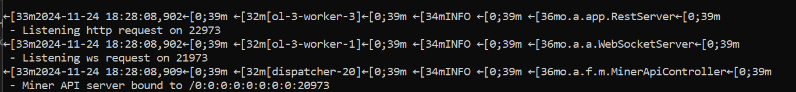

# Alephium Web3

[![Github CI][test-badge]][test-link]
[![NPM][npm-badge]][npm-link]
[![code style: prettier][prettier-badge]][prettier-link]

A Typescript library for building decentralized applications on Alephium.

## Getting started

You could run the following command to scaffold a skeleton project for smart contract development:

```
npx @alephium/cli init <project-dir> [-t (base | react | nextjs)]
```

Please read the [documentation](https://docs.alephium.org/sdk/getting-started/) for more.

## Packages

There are a few packages in this repository:

1. `@alephium/cli` is the CLI tool for dApp development.
2. `@alephium/web3` is the core and base package for all dApp development.
3. `@alephium/web3-wallet` contains wallet related functions.
4. `@alephium/web3-test` contains test related functions.
5. `@alephium/web3-react` contains react components to help authenticate and interact with the Alephium blockchain
6. `@alephium/get-extension-wallet` contains functions to get the extension wallet object
6. `@alephium/walletconnect` contains Alephium's WalletConnect implementation

## Development

Please refer to `package.json`.


[test-badge]: https://github.com/alephium/alephium-web3/actions/workflows/test.yml/badge.svg
[test-link]: https://github.com/alephium/alephium-web3/actions/workflows/test.yml
[npm-badge]: https://img.shields.io/npm/v/@alephium/web3.svg
[npm-link]: https://www.npmjs.org/package/@alephium/web3
[prettier-badge]: https://img.shields.io/badge/code_style-prettier-ff69b4.svg
[prettier-link]: https://github.com/prettier/prettier
[release-notes]: https://github.com/alephium/alephium-web3/releases

## Test
Follow steps shown below to run test cases

1. Open terminal ( use git bash if your OS = windows)
2. Run the following command 
    ```
    pnpm install
    ```
3. Run the following command
    ```
    pnpm build
    ```
4. Run a devnet node by following this document: 
https://docs.alephium.org/full-node/getting-started#devnet

5. Successfull node running should display 3 servers are running:


6. Run command on terminal 
    ```
    pnpm test
    ```